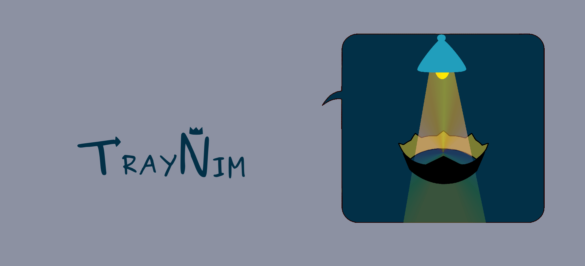

<p align="center"> 
  
</p>
<h1 align="center"> TrayNim </h1>
<h3 align="center"> A simple ray tracer written in Nim </h3>  

</br>

<p align="center"> 
  
</p>

<!-- Add buttons here -->


Traynim is a CLI program written in Nim that lets you create photorealistic images using spheres and planes. 
It can also be used as a tool for converting PFM files to PNG, PPM, BMP and QOI.

## Demo-Preview
<p align="center"> 
  
</p>

# Table of contents

- [Demo-Preview](#demo-preview)
- [Table of contents](#table-of-contents)
- [Installation](#installation)
- [Usage](#usage)
- [Contribute](#contribute)
- [Release History](#release-history)
- [License](#license)


## Installation
[(Back to top)](#table-of-contents)

### Dependencies
- nim >= 1.6.4
- nimble
- ffmpeg for the animations


### Download and building
You can download the latest stable release [here](https://github.com/ottyanna/traynim/releases), and unpack it
   ``` sh
   $ tar -xvf /path/to/tar #or zip file -C /path/to/your/directory
   ```
or if you want, you can clone this repository
   ``` sh
   $ git clone https://github.com/ottyanna/traynim.git
   ```

### Testing
You can test if the code works fine by running the following command:
``` sh
   $ nimble test
   ```

<!--  
Functionalities implemented:
- Read from PFM files
- Tone mapping
- Gamma correction
- Save files in PNG, PPM, BMP and QOI formats
-->
## Usage
[(Back to top)](#table-of-contents)

```sh
$ nimble run traynim
```
will generate the executable.

To display the help, you can run

```sh
$ ./traynim --help
```

To generate the demo animation shown in [Demo-Preview](#demo-preview), just run

```sh
$ ./animation.sh >/dev/null
```

To generate just one image with default paramethers use instead

```sh
$ ./traynim demo
```

You can change the size of the image, the angle view or the camera type by running `--help`.

To just use the `pfm2format` feature, you have to bear in mind that just PNG, PPM, BMP and QOI formats are supported.

## Contribute
[(Back to top)](#table-of-contents)

If you wish to contribute or you have just found any bug, feel free to open an issue or a pull request on the GitHub repository.

## Release History
[(Back to top)](#table-of-contents)

See the [CHANGELOG.md](https://github.com/ottyanna/traynim/blob/master/CHANGELOG.md) file.

## License
[(Back to top)](#table-of-contents)

[GNU GPLv3](https://choosealicense.com/licenses/gpl-3.0/)
