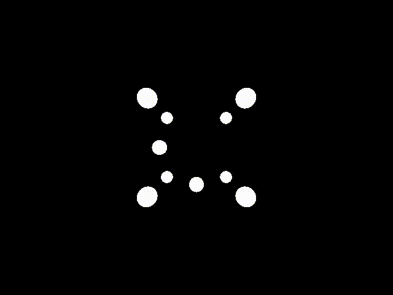

<p align="center"> 
  
</p>
<h1 align="center"> TrayNim </h1>
<h3 align="center"> A simple ray tracer written in Nim </h3>  

</br>

<p align="center"> 
  
</p>

<!-- Add buttons here -->


Traynim is a CLI program written in Nim that lets you create photorealistic images using spheres and planes. 
It can also be used as a tool for converting PFM files to PNG, PPM, BMP and QOI.

To get a more detailed description of the source code, refer to the <a href="htmldocs/theindex.html">documentation</a>.

## Demo-Preview

Traynim can produce images like these with four different renderers: path tracer, on/off, point light and flat renderer respectively. <a href="gallery/gallery.html">Here</a> you can find some more images.

<p align="center"> 
  
  
</p>

<p align="center">
  
  
</p>

<p align="center">
  
</p>


# Table of contents

- [Demo-Preview](#demo-preview)
- [Table of contents](#table-of-contents)
- [Installation](#installation)
- [Usage](#usage)
- [Examples](#examples)
- [Contribute](#contribute)
- [Release History](#release-history)
- [License](#license)
- [Footnotes](#footnotes)

## Installation
[(Back to top)](#table-of-contents)

### Dependencies
- [nim](https://github.com/nim-lang) >= 1.6.4
- [nimble](https://github.com/nim-lang/nimble)
- [ffmpeg](https://www.ffmpeg.org/) and [parallel](https://en.wikipedia.org/wiki/GNU_parallel) for the bash scripts


### Download and building
You can download the latest stable release [here](https://github.com/ottyanna/traynim/releases), and unpack it
   ``` sh
   $ tar -xvf /path/to/tar #or zip file -C /path/to/your/directory
   ```
or if you want, you can clone this repository
   ``` sh
   $ git clone https://github.com/ottyanna/traynim.git
   ```

### Testing
You can test if the code works fine by running the following command:
``` sh
   $ nimble test
   ```

## Usage
[(Back to top)](#table-of-contents)

```sh
$ nimble run traynim
```
will generate the executable.

To display the command-line help, you can use

```sh
$ ./traynim --help
                       
Usage:
  traynim {SUBCMD}  [sub-command options & parameters]
where {SUBCMD} is one of:
  help        print comprehensive or per-cmd help
  renderer    
  stack       
  pfm2format  
  demo        

traynim {-h|--help} or with no args at all prints this message.
traynim --help-syntax gives general cligen syntax help.
Run "traynim {help SUBCMD|SUBCMD --help}" to see help for just SUBCMD.
Run "traynim help" to get *comprehensive* help.
```

### `renderer`

To generate one image with default parameters (the default and example input file is [here](examples/example.txt)) use

```sh
$ ./traynim renderer
```

You can change the size of the image and the `png` output conversion luminosity by running `--help`.

As shown in [Demo-Preview](#demo-preview), it is possible to use different rendering methods by using the `-a` or `--algorithm` flag.

 Renderer |  Feature | Option
:-------------------------:|:-------------------------: | :------:
Simple Path Tracer  | Uses Russian roulette method | `-a=pathtracing` (Default)
Point Light Renderer  | The source light is considered a dirac delta | `-a=pointlight`
Flat Renderer | The scene is traced without considering the radiance, so it is in solid colors | `-a=flat`
On/off renderer | There are just two colors, one for the objects, one for the background | `-a=on/off`

While the path tracer is really slow, the flat, point light and on/off renderers are fast, so they are useful for debugging or to get an idea if the object positions are right. The time scale depends really on the scene but for a simple scene it can take up to 5 minutes for the path tracing while about 5 to 20 seconds for the others. 
<!--- Moreover, bear in mind that if you use a sphere for the sky the on/off renderer--> 

ANIMATIONS

You can generate the animations by tweaking [this](scripts/generateImage.sh) bash script, then just run

```sh
$ ./animation.sh NUM_OF_CORES >/dev/null
```

where `NUM_OF_CORES` are the number of cores to parallelize the generation.

### `stack`

Generating an image can take long, especially if you need to cancel out noise. You can reduce the time by using the [antialiasing](#antialiasing-in-case-of-flat-rendering) feature or you can just use the `stack` command that takes advantage of the seekability property of the chosen number generator (by setting a different `initSeq`). Once you generated the same image with different noise (again by setting `-initSeq`to different values), the `stack` command merges them into the same image. 
The only thing you have to bear in mind is that the images must be named img0, img1, img2 etc. This [script](scripts/stackMain.sh) makes these procedure automatic using [parallel](https://en.wikipedia.org/wiki/GNU_parallel).

You can also use this feature to reduce noise AND to make blurry images.[Here](#example-for-the-blurry-effect) you can see an example.

### `pfm2format`

To use the `pfm2format` feature, you have to bear in mind that just PNG, PPM, BMP and [QOI](https://en.wikipedia.org/wiki/QOI_(image_format)) formats are supported.


### `demo` (Deprecated)

The `demo` command is still usable, but since version 1.0.0, it's better to use files for scenes. Despite this, if you wish to create your images with `for` cycles, like the scene in the on/off example in the [demo_preview](#demo-preview) it's better to tweak directly the `demo` part of the code.

## Examples

### Antialiasing in case of flat rendering:

You can reduce the noise of the image by increasing the number of rays or by increasing the samples per pixel. The latter can be used with all the tracing algorithms.

The scene has a white light in coordinates (-50, 30, 30). The number of rays is always 4 (`-r=4`) and the luminosity is 0.8.

 `-s=1` |  `-s=4` | `-s=25`
:-------------------------:|:-------------------------:|:-------------------------: 
  |   | 
4 seconds | 16 seconds | 104 seconds

As you can see the noise is sensibly reduced by increasing the samplesPerPixel.

### Example of the noise reduction with `stack`

<p align="center"> 
  
  
</p>

On the left there is one of the six images generated with different `initSeq` value.
On the right there is the "stacked" image: you can see how it gets less noisy.

### Example for the blurry effect

<p align="left"> 
  
</p>

This image was obtained by rotating both spheres a little. In case of path tracing you could also use a different `initSeq` value, in order to reduce the overall noise. Refer to this [script](scripts/stack.sh) for an example.

### `--gamma` and `--factor` variation in `pfm2format` feature:

<!---maybe we need to write the site of the image--->

|    options     | `-f=0.15`             |  `-f=0.30` | `-f=0.50`
:---------:|:-------------------------:|:-------------------------:|:-------------------------: 
`-g=1.0` |   |   |  
`-g=2.2` |  |   |  

You can compare different values for `gamma` and `factor` tweaking the bash script in [img/pfm2formatExamples](img/pfm2formatExamples/) folder<sup id="a1">[1](#f1)</sup>

## Contribute
[(Back to top)](#table-of-contents)

If you wish to contribute or you found any bug, feel free to open an issue or a pull request on the GitHub repository.

Or if you just want to show your images made with the program, contact us, we'll be happy to show them on the project website. 

## Release History
[(Back to top)](#table-of-contents)

See the [CHANGELOG.md](https://github.com/ottyanna/traynim/blob/master/CHANGELOG.md) file.

## License
[(Back to top)](#table-of-contents)

[GNU GPLv3](https://choosealicense.com/licenses/gpl-3.0/)

## Footnotes
<b id="f1">1</b> The sample image was taken from [here](https://filesamples.com/formats/pfm). [↩](#a1) 